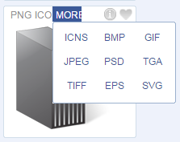

## 前端工具
### 1.svg在线生成工具：[Method Draw](http://editor.method.ac/)
Method draw 是一个基于 web 的 SVG 编辑器，带有一个两边伴有工具的画布的直观的界面。  
你可以画线条，形状，输入文本或者使用内置的形状，然后编辑绘画兑现的属性。  
使用 SVG 格式导出图像（也可以变成 SVG base64 格式）或者直接使用 PNG 保存。
还可以导入图片编辑，注意导出svg步骤：File-Save Image...(Ctrl+S)默认就是导出svg格式  
界面是这样的  


试着用它画了一个流程图


注意右边的那条合同金额小于50万的，是用几个矩形处理的，  
没有现成的弯曲的流程图，不过你还可以绘制路径或者修改其他图形的路径点
### 2.[b64](http://b64.io/)
b64 是一个通过将图像格式转换为 base64 来进行优化的小工具。  
你可以直接把你的 SVG 图像（或者 JPG 和 PNG 也行）扔进去，然后直接把结果作为 CSS 弄到你的网站上就行了。  
界面是这样的  
 

我把上面的method-draw-images(2).svg拖进去得到的结果是这样的：
```CSS
/* file size: 7.3ko | already optimized | base64 size: 9.8ko */
.method-draw-image-2 {
  background-image: url(data:text/html;base64,PHN2Zy......此处省略N个字符);
}
```
这样就可以在css中直接调用了
### 3.[Flatty Shadow](http://flattyshadow.com/)
Flatty Shadow在线为Icon图标生成长阴影效果  


它还可以选择矩形或扁平效果，比如这样

 

### 4.[Animate.css](http://daneden.me/animate/)
Animate.css不是生成代码的工具，但绝对是各种动画效果的参考示例网站。


记得用键盘上的`↓`体验哦

### 5.[Vivus](http://maxwellito.github.io/vivus/) [github](https://github.com/maxwellito/vivus)
Vivus 是一个能动画js类库，它能够给SVG图像显示出被画出来的过程。  
Vivus是没有其他类库依赖的（比如jQuery)。  
你仅仅需要在页面中加入这个.js文件，然后传入需要被用来动画的SVG部分就行。  
同时通过指定一些配置，它能够在页面加载后直接显示动画效果。就像写字效果一样，把路径慢慢画出来

首页上是这样


安装方式
```
	* Bower: bower install vivus
	* NPM: npm install vivus
	* jsDelivr CDN: //cdn.jsdelivr.net/vivus/latest/vivus.min.js
	* CDNJS CDN
	* WebJars
```
UsageAs I said, no dependencies here. All you need to do is include the scripts.  
Inline SVG
```XML
<svg id="my-svg">
  <path...>
  <path...>
  <path...>
</svg>
```
```js
<script>  new Vivus('my-svg', {duration: 200}, myCallback);</script>
```
Dynamic load
```html
<object id="my-svg" type="image/svg+xml" data="link/to/my.svg"></object>
```
```js
<script>  new Vivus('my-svg', {duration: 200}, myCallback);</script>
```
or
```html
<div id="my-div"></div>
```
```js
<script>  new Vivus('my-div', {duration: 200, file: 'link/to/my.svg'}, myCallback);</script>
By default the object created will take the size of the parent element, this one must have a height and width or your SVG might not appear.
If you need to edit this object, it is accessible in the onReady callback:
new Vivus('my-div-id', {
  file: 'link/to/my.svg'
  onReady: function (myVivus) {
    // `el` property is the SVG element
    myVivus.el.setAttribute('height', 'auto');
  }
});
```
Check out the hacks page for more tricks.
### 6. [easyicon](http://www.easyicon.net/)
搜索图标的网站，非常实用的图标，找素材的可以在这找，不过只支持`png，ico，icns`下载格式

### 7. [阿里巴巴iconfont矢量图标库](http://iconfont.cn/)
Iconfont.cn是由阿里巴巴UX部门推出的矢量图标管理网站，也是国内首家推广Webfont形式图标的平台。  
网站涵盖了1000多个常用图标并还在持续更新中，Iconfont平台为用户提供在线图
可以导出`SVG，AI，PNG`格式，然后可以自己再修改  
界面  


### 8. [fontello](http://fontello.com/)一款WEB-FONT合成器 和 [icomoon](http://icomoon.io/app/)
Fontello:免费图标素材生成工具是一个免费Web-font 图标大集合，设计师不仅拥有所有你需要的图标，  
而且你可以挑选并选择你所需要的字形，并编译成自己需要的一套，自定义Icon的方法非常简单，以后你就可以用自己的一套网站素材了。  
Fontello.com提供了12种字体icon的在线制作，你可以选择其中的某几个icon生成你需要的图标.  
不仅如此，你还可以在自己用ai或其他工具自己制作svg图标，然后上传到网站上，让网站帮你生成字体图标，非常方便.  
不过网站上已经提供的图标非常的多，非常多，非常  
而且导出之后就有html的demo可以运行查看效果  
界面  

### 9.[Peise.net](http://www.peise.net/palette/)
Peise.net提供了各种颜色的配色方案，以及颜色的理论知识。  
界面如下  

### 10.[Freepik.com](http://www.freepik.com/) 和 [FIND ICONS](http://findicons.com/)
Freepik.com除了提供ICON的下载之外，还提供了其他设计素材的下载。  
我到FIND ICONS上搜索了server后，总共有11中支持的下载图片格式，太赞了  

### 11.[Font 2U](http://www.fonts2u.com/)
Font2u提供了各种字体的下载以及字体的详细信息。  
界面  
  
看到第一行了吧，支持N种语言

### 12.最后分享一个小游戏：[pong](http://demos.bonsaijs.org/demos/pong/index.html)


你能坚持多久?

`参考文章`

http://www.w3cplus.com/source/front-end-developer-excellent-tool.html

http://www.admin10000.com/document/6662.html

http://www.zding.cn/weburl/ionc/265.html